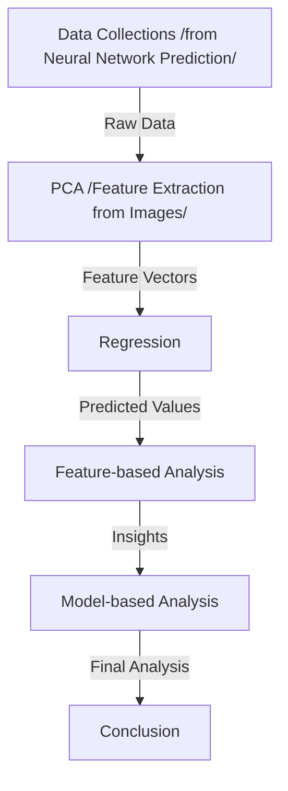

# PCR Diagnostics

## Workflow

## Related Code

| Procedure              | File                                                  | Description                                                  |
| ---------------------- | ----------------------------------------------------- | ------------------------------------------------------------ |
| Data Collection        | ./Python-feature-engineering/Data-Collection.ipynb    | Feature-based extraction (not used) *MNIST Data Employed in Python Package* |
|                        | ./Python-feature-engineering/PCA_reconstruction.ipynb | PCA dimension reduction & image reconstruction               |
|                        | ./reconstructed/reconstructed_X/                      | reconstructed images of the first X number of PCA features   |
|                        | ./Python-feature-engineering/PCA_result/PCA-X.csv     | PCA reduced features                                         |
|                        | ./XXX                                                 | encoder(not used)                                            |
| MLR                    | ./mlr result                                          | TODO: Add mlr code inside!!!                                 |
| Feature-based Analysis | ./reconstructed/Sl_analysis.Rmd                       | Codes for global pooling / local gradient, GSI/LSI value calculations |
|                        | ./reconstructed/GRAD-X-350-1.csv                      | the LSI matrix comparing the image reconstructed from first X PCA features and image reconstructed from first 350 PCA features, 1 stands for the 1st image in the *./reconstructed/reconstructed_X/* Dataset |
|                        | ./reconstructed/SIM-X-350-1.csv                       | the GSI matrix comparing the image reconstructed from first X PCA features and image reconstructed from first 350 PCA features, 1 stands for the 1st image in the *./reconstructed/reconstructed_X/* Dataset |
|                        | ./model-analysis/Pearson_Correlation_Test.Rmd         | Code for Pearson Correlation Test (data contained)           |
|                        | ./model-analysis/AIC-fitting.Rmd                      | Cubic Fitting for AIC value w.r.t different # PCA features   |
|                        | ./model-analysis/AIC_summary_info.csv                 | AIC curve fitting result (extracted from AIC-fitting.Rmd)    |
| Model-based Analysis   | ./model-analysis/epoch-M-hidden/Epoch_X_result.csv    | prediction probability obtained from the Xth epoch (X ranged from 1 to 50, M is the depth of the NN, could be 2 or 20) |
|                        | ./model-analysis/epoch-M-hidden/epoch_accuracy.csv    | NN classification accuracy on test set of the 1st to 50th epoch |
|                        | ./model-analysis/epoch-M-hidden/epoch_loss.csv        | NN test loss of the 1st to 50th epoch                        |
|                        | ./model-analysis/model_analysis.Rmd                   | EM parameter estimation code of symmetric beta dist          |
|                        | ./model-analysis/EM_result                            | EM parameter estimation result                               |
